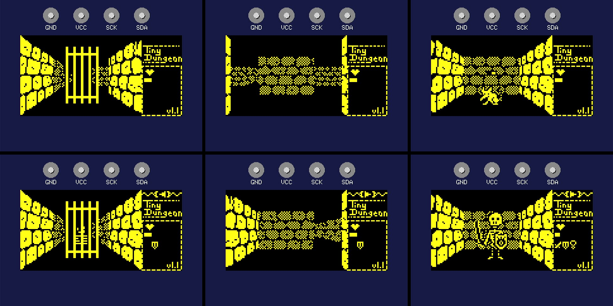
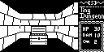
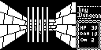
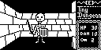
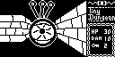

# Tiny Dungeon
This is my implementation of a simple *Dungeon Master* "clone" for the ATtiny85 with an 128x64 OLED display (especially for the TinyJoypad platform). 

 Some impressions of the dangerous journey into the dungeon! 

---
## The Idea
When I discovered Daniel C's TinyJoypad project I was stunned by all the cool retro like games Daniel had created. 

I started to play with the code of Tiny invaders and decided to try to make it even a little more fun ([TinyInvader v4.2](https://github.com/Lorandil/Tiny-invaders-v4.2)).
When I had finished most of my ideas on that project, I thought of a game project of my own.

I always loved games like *The Bard's Tale* or *Dungeon Master* in the 80s and early 90s.
Why don't develop something like a 3D dungeon crawler on the TinyJoypad platform?
Or die trying?

**The dungeon is the limit!**

---
## The Goal of the Game
Find the Foutain of Life to save your true love!

*A more elaborate version of the story will follow later :)*

***Let me tell you a story:***

---
## Game Features (February 2023)
* 3D graphics (ok - it's only pseudo 3D)
* Large dungeon size of 16x16 tiles
* Four different monster types
* Treasure chests
* Teleporters
* Magical items
* Spinners
* Compass
* Doors
* Bars
* Switches
* Sound effects

---
## Combat System
The health state of the player and the monsters are persistent, so damaged monsters will stay damaged (as will the player until healed by a potion).  

### Initiative
Some monsters are faster than the player and will attack first.
Others like undead are slower but deadly nonetheless. 

### Attack or Run
If it's the player's turn, the player can chose to attack by pressing the button or run away by moving back. 
If the monster survives the attack, it will retaliate immediately.

### Damage System
The monster's damage is determined by a roll of a D8 plus/minus some monster specific value. The damage value will be reduced by the player's armour (if present) and then subtracted from the players hit points. The player's damage is determined by a D8 and a weapon bonus (if a weapon is equipped) and subtracted from the monster's hit points.

### Rewards on Dead Monsters
Some monsters may leave items which will be automatically added to the player's inventory.

---
## Losing the game
The player loses the game, if the hit points drop to 0. 
When the game is lost, the game will restart after pressing the button.

---
## Winning the Game
The goal of the game is reaching the Fountain of Life, gaining the desperately needed remedy for the player's lover.

---
# *** SPOILERS AHEAD ***

## List of Objects
* Compass - always points north
* Wooden shield - massively reducing damage taken
* Sword  - increases damage of attacks substantially
* Amulet of True Sight - displayed as an eye, lets the player see through fake walls
* Ring of Orientation - displayed as a ring, lets the screen flash when teleporting or spinning
* Healing Potions - granting additional hit points

---
## Engine Features
* real-time rendering in 96x64 pixels
* real-time bitmap scaling in up to three sizes (full, half, quarter) with a variable threshold for each view distance to optimize the visuals
* all bitmaps have a mask to keep the background from shimmering through
* view distance is up to three tiles (depending on the object)
* convincing movement illusion when walking through tunnels (done by mirroring left and right wall bitmap on every step)
* different sound effects
* some magic items
* easily expandle scripted interactions (monsters, switches, chests, teleporters, spinners)
* extensible design (levels, bitmaps, interactions, ...)
* highly opimized for size (target system is an ATtiny85 with 512 bytes of RAM and 8kB of flash)
* code compiles for ATtiny85 with xled1306 library
* code compiles for Arduino Uno R3, Leonardo, Mega 2560, Zero and many boards more using the Adafruit SSD1306 library (encapsuled in `"TinyJoypadUtils.h"`)
* Screenshot functionality: Dump screen content to serial port as a hex dump.
  *This feature is only available on MCUs with serial port, so not on ATtiny85 ;)*

---
## Engine Limitations
* some objects don't look good when scaled (even with the variable threshold)
* on-wall objects (switches, doors) aren't rendered correctly when seen from the side -> architectural measures required (e.g. doors need to be set back by at least one field)
* at the moment non-wall objects like monsters, chests or doors are only rendered in front of the player.
* no floor or ceiling for now (mostly because of lack of memory)
* max. dungeon size is 256 tiles

---
## Technical Details
It soon became clear, that regarding the limited flash capacity (8kB) of the ATtiny85, a data driven approach was required. All walls, monsters and encounters/events are organized in tables which makes the game easy to extend, yet saving a lot of space.

### Flash Memory Requirements for the Graphics Data
* all walls require ~1600 bytes
* monsters require ~900 bytes
* the status window requires 256 bytes
* the compass requires 20 bytes
* other objects require ~1200 bytes
This sums up to nearly 4000 bytes - meaning half the flash memory is used to store the game's graphics!

---
## Current Size
Sketch uses **7760 bytes (94%)** of program storage space. Maximum is 8192 bytes **(432 bytes left)**.
Global variables use **326 bytes (63%)** of dynamic memory, leaving **186 bytes** for local variables. Maximum is 512 bytes.

---
## Historical Notes
I started the project in December 2020 with a small 8x8 level and the first *Dungeon Master* inspired wall bitmaps. During a creative blockade regarding game mechanics and the goal of the game, I created a simple *Mine Sweeper*ish game to let my brain relax a bit. That's how [TinyMinez](https://github.com/Lorandil/TinyMinez) was born ;)

After that I decided to polish and publish the [Cross Development Framework](https://github.com/Lorandil/Cross-Development-for-TinyJoypad) I developed during the work on TinyDungeon and TinyMinez.

In the meantime I exchanged the first *Dungeon Master* like walls with some more *Eye of the Beholder* like walls (well, that's how I called them) with rough round stones instead of the plain brick walls.

I realized that my first implementation of the 3D projection felt somehow wrong. That was because it was wrong. I fixed a stupid bug with the diagonal walls (there are two pairs required, not only one) and suddenly even the halls looked like they should :)

In early 2023 I optimized some bitmaps for better scaling (especially the chest images and the skeleton) and updated the README.md.

---
## Some Early Screenshots from April 2021

 The player has opened a chest and found a compass!
 

 No trespassing here...
 

 Hi folks (first skeleton design with a simple wooden shield)!
 

 Uh oh...

---
## Credits/Resources
* an older version of [ssd1306xled](https://github.com/tinusaur/ssd1306xled) library by tinusaur/Neven Boyanov - a small and fast library for I2C communication with SSD1306 compatible boards (I will try to use the current version in a later release)
* [ATTinyCore 1.5.2](https://github.com/SpenceKonde/ATTinyCore) by Spence Konde - in my opinion the best ATtiny core available!
* [Arduino IDE 2.0](https://github.com/arduino/arduino-ide) the official IDE
* the [TinyJoypad](https://www.tinyjoypad.com/tinyjoypad_attiny85) project which inspired me to develop TinyDungeon - thanks Daniel C!
* [image2cpp](http://javl.github.io/image2cpp/) a great online bitmap converting tool

---
## License
TinyDungeon is published under the MIT license.
